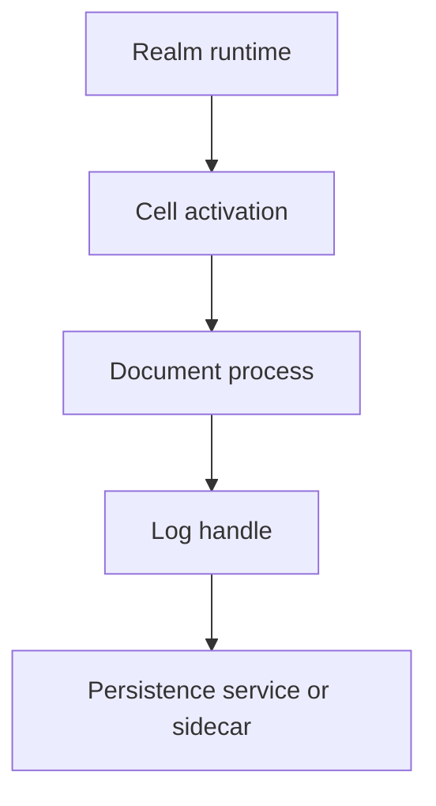

# Commonplace Log 0.1: Cell-Owned Document Profile

**Status:** Proposed  
**Date:** 2026-08-22  
**Applies to:** `commonplace-log` 0.1-draft with the BEAM-native amendment  
**Purpose:** Define the log semantics used by ordinary Commonplace Documents without requiring distributed or multi-writer Document execution.

## 1. Decision

The existing Commonplace Monotonic Log protocol remains a valid language-neutral storage and replication protocol. Its abstract state is a map of independent, gapless writer sequences.

Ordinary Commonplace Documents use a deliberately narrower profile:

1. A Document has one UUID-addressed authoritative log.
2. That log has exactly one append lane, identified by one `writer_id`, for its entire lifetime.
3. Exactly one fenced Cell activation may extend that lane at a time.
4. Physical replicas of the log may exist in several places, but they do not independently originate Document events.
5. A branch, offline mirror, rejected-history replacement, or unfenced recovery creates a new log UUID connected to the old log by lineage.

This profile postpones the distributed multi-writer Document problem while preserving the existing multi-writer machinery for future protocols and specialized applications.

## 2. Relationship to the base log protocol

This document is a **restricted application profile**, not a replacement entry format.

The following remain unchanged:

- canonical entry encoding;
- `log_id`, `entry_id`, `writer_id`, and `writer_seq` fields;
- append-only storage and immutable entries;
- per-writer gap and fork detection;
- frontier/range replica synchronization;
- the Elixir Engine/Persistence boundary;
- the TypeScript workalike and shared conformance corpus; and
- the rule that replica-local arrival order has no portable meaning.

The base protocol permits several writer sequences in one logical log. This profile permits only one writer sequence in any log interpreted as an ordinary Document. A store may continue to support the more general representation internally.

## 3. Scope

This profile specifies:

- the relationship between Log, Document, Cell, and Realm;
- the ownership and lifetime of the Document append lane;
- the distinction between replica synchronization and lineage synchronization;
- branch and offline-mirror identity rules;
- Realm activation and migration constraints;
- the public append boundary; and
- behavior for missing logs and unsupported multi-writer histories.

It does not specify:

- distributed Cell execution;
- multi-writer Document reduction;
- CRDT semantics;
- Yjs or Yepoch encodings;
- directory snapshot representation;
- capability token syntax;
- cross-log transactions;
- retention or compaction; or
- consensus among simultaneous writers.

## 4. Vocabulary

### 4.1 Log

A **Log** is an immutable, append-only durable object identified by `log_id`.

Under this profile, a Document log contains exactly one gapless writer sequence. The log is durable data; it is not intrinsically a process, Cell, execution environment, or permission boundary.

### 4.2 Append lane

An **append lane** is the sequence identified by `(log_id, writer_id)`. Its entries are numbered from 1 without gaps.

The `writer_id` identifies a durable protocol lane. It is not a user identity, capability, author identity, or Realm incarnation.

### 4.3 Writer lease

A **writer lease** is a fenced grant allowing one active Cell activation to append to a Document log’s lane.

The lease has a monotonically increasing fencing epoch or equivalent compare-and-swap token. A process holding an obsolete lease MUST be unable to commit, even if it remains alive after routing moves elsewhere.

### 4.4 Replica

A **Replica** is a physical copy of some compatible prefix of a log. Replicas share the same `log_id` and contain byte-identical entries at matching coordinates.

Replication does not create a new Document, branch, or lineage member.

### 4.5 Document

A **Document** interprets a log through a schema, reducer, mounted message handlers, attributes, and verbs. The active Document normally corresponds to a BEAM process that serializes messages and appends accepted effects.

The Document may share its UUID with its authoritative log when a separate identifier provides no value.

### 4.6 Lineage

A **Lineage** relates distinct Document logs derived from common state or history. A lineage record identifies at least:

- the new `log_id`;
- its parent `log_id`;
- the parent version, commit, or snapshot from which it was derived;
- the reason for derivation, such as `branch`, `mirror`, `recovery`, or `yepoch`; and
- any application-specific mapping needed to translate operations.

Lineage is not raw log replication. Lineage members have different log UUIDs.

### 4.7 Cell

A **Cell** is the durable unit of authority, custody, activation, forking, capability issuance, and placement. A Cell owns or governs a set of Documents and their logs.

Exactly one Realm contains the active primary activation of a Cell at a time under this profile.

### 4.8 Realm

A **Realm** is a BEAM runtime placement capable of activating one or more Cells. A Realm may be restarted, replaced, or moved without changing the identity of its Cells, Documents, or logs.

A Realm is not the root authority for a Document merely because its storage sidecar contains the Document’s bytes.

### 4.9 Environment

An **Environment** is the contextual binding in which a graph of versioned Documents is activated. It supplies name resolution, selected versions, capabilities, and routing to active Cell/Document processes.

An Environment does not own log identity or bypass Cell authority.

## 5. Normative invariants

A conforming ordinary Document MUST satisfy all of the following:

1. **One log.** The Document names one authoritative `log_id` at a time.
2. **One lifetime lane.** The authoritative log contains entries from exactly one `writer_id` for its entire lifetime.
3. **One active appender.** At most one unfenced Cell activation may append to that lane.
4. **Serialized acceptance.** The authoritative Document process serializes accepted messages before appending their durable effects.
5. **No writer exposure.** Application callers do not choose `writer_id`.
6. **Replica identity.** Physical replicas of the same log retain the same `log_id` and copy existing entries; they do not create a new append lane merely because they run on another server.
7. **New history, new UUID.** A branch, editable offline mirror, unfenced clone, or history rewrite receives a new `log_id`.
8. **Explicit lineage.** Every derived log records its relationship to its parent outside the raw log replication protocol.
9. **Non-semantic arrival.** Replica-local arrival order MUST NOT determine Document replay or equality.
10. **Cell authority.** Authorization, capabilities, admission, and fork policy are enforced by the Cell/Document layer, not by the persistence adapter.
11. **Realm independence.** Moving a Cell between Realms does not itself change `log_id`, `writer_id`, or Document identity.
12. **No implicit multi-writer interpretation.** A Document runtime encountering more than one writer lane MUST refuse ordinary activation unless an explicitly selected multi-writer profile defines deterministic interpretation.

## 6. Public append boundary

The ordinary public API MUST NOT invite callers to select an append lane.

An illustrative API is:

```elixir
@type log_handle :: term()

@callback create_log(log_id(), options()) ::
            {:ok, log_handle()} | {:error, term()}

@callback open_log(log_id(), writer_lease()) ::
            {:ok, log_handle()} | {:error, term()}

@callback append(log_handle(), body(), options()) ::
            {:ok, append_result()} | {:error, term()}
```

The handle binds together:

- `log_id`;
- the log’s durable `writer_id`;
- the current fenced lease epoch;
- the persistence adapter and store reference; and
- any retry or idempotency context.

The lower-level Engine MAY continue to accept `writer_id` explicitly because it implements protocol mechanics. That parameter is internal to the profile and MUST NOT be treated as ambient application authority.

Implementations SHOULD accept a caller-generated operation or idempotency identifier so an ambiguous transport failure can be retried without accidentally appending a second logical effect.

## 7. Creation and lookup

Log creation is explicit.

- `create_log(log_id, ...)` MUST be idempotent for the same logical log.
- Reading, opening, taking a frontier, or tailing an unknown `log_id` MUST return `log_not_found`.
- A read operation MUST NOT create an empty log as a side effect.
- A newly created ordinary Document log MUST persist its one durable `writer_id` before acknowledging creation.
- Rekeying an existing ordinary Document log to a second `writer_id` is prohibited.

If exclusive continuation under the existing lane cannot be proven, recovery MUST create a new lineage log rather than silently rekey the old log.

## 8. Replica synchronization

`Commonplace.Log.Sync` synchronizes physical replicas of the **same** logical log.

Its job is limited to:

- comparing frontiers;
- transferring complete writer ranges;
- inserting byte-identical compatible entries;
- detecting gaps, writer forks, and entry-ID collisions; and
- reaching equal replica state.

It MUST NOT:

- decide whether an application edit is authorized;
- accept or reject offline work;
- translate Yjs updates;
- cross a Yepoch boundary;
- merge branches;
- create lineage; or
- invoke Document verbs as a side effect of receiving bytes.

Raw replica synchronization should normally be available only across trusted internal storage links. Externally held editor or viewer capabilities operate on Document/Cell APIs, not directly on persistence merge operations.

## 9. Lineage synchronization

Synchronization between related Documents is an application operation above `Commonplace.Log.Sync`.

An illustrative flow is:

1. A source Document presents proposed operations, their source lineage/version, and an invoking capability.
2. The destination Cell resolves the target Document and authorizes the requested sync verb.
3. The destination Document validates the proposal against its current state.
4. Accepted effects are expressed as new entries in the destination’s own authoritative log and append lane.
5. Rejected effects are reported without mutating destination history.
6. The source may locally undo rejected effects, derive a new Yepoch, or fork another lineage log.

The destination never imports a source entry merely because it is well-formed log data. Admission is a semantic decision; replica merge is not.

## 10. Branches

Creating a branch MUST create a new logical Document log UUID.

The branch records a lineage edge to an exact parent version. It MAY initially represent parent state through immutable snapshot references, pinned heads, or lazy copy-on-write structures rather than eagerly copying every entry.

After branching:

- parent and child append independently to their own single writer lanes;
- neither uses raw replica synchronization to copy post-branch entries into the other;
- branch merge is a Document/Cell verb; and
- accepted merge effects are appended as new child or destination history.

Directory copy-on-write, pinned child heads, and cadence-bundled directory updates are higher-level mechanisms and do not alter these log identity rules.

## 11. Offline mirrors

An editable offline mirror is a new Document in a client Cell, not a writable physical replica of the server Document’s log.

Therefore:

- the mirror has its own `log_id` and writer lane;
- its lineage points to the server Document version used to initialize it;
- its editor may apply local CRDT/Yjs operations immediately;
- synchronization invokes a capability-authorized verb on the server Cell;
- server acceptance produces new entries in the server Document log; and
- rejection may cause local undo, remapping, or a Yepoch transition without deleting either append-only history.

A read-only cache MAY remain a physical replica of the same `log_id` because it does not originate edits.

## 12. Realm activation topology

Logical authority nests under the Cell; persistence remains a Realm service or sidecar:



An illustrative BEAM supervision shape is:

```text
Commonplace.Realm.Supervisor
├── Commonplace.Realm.Persistence
├── Commonplace.Cell.Activation <cell UUID A>
│   ├── Commonplace.Document.Process <document/log UUID 1>
│   └── Commonplace.Document.Process <document/log UUID 2>
└── Commonplace.Cell.Activation <cell UUID B>
    └── Commonplace.Document.Process <document/log UUID 3>
```

The exact supervision tree is implementation-specific. The normative point is that a raw Log server is not the semantic message-handling actor merely because an adapter uses a process to own a file, lock, or connection.

## 13. Realm migration and failover

Moving a Cell’s primary activation between Realms proceeds as a fenced handoff:

1. The placement authority selects a destination Realm.
2. The current Cell activation is quiesced or fenced from future commits.
3. A durable compare-and-swap advances the Cell activation/lease epoch.
4. The destination Realm activates the Cell using the new epoch.
5. Document processes reopen their existing logs and retain their existing `writer_id` values.
6. Routing changes to the destination activation.

Every persistence commit MUST verify the current fencing epoch, either directly or through a store handle that cannot outlive it.

If the system cannot establish exclusive continuation, it MUST NOT create a second writer lane in the same ordinary Document log. It must stop for intervention or derive a new recovery log with an explicit lineage edge.

## 14. Cell, Realm, and sidecar responsibilities

| Responsibility | Owner |
| --- | --- |
| Document identity and membership | Cell |
| Log identity used by a Document | Cell/Document metadata |
| Append-lane lease and fencing | Cell placement authority |
| Message ordering and semantic acceptance | Document process |
| Capability issuance and authorization | Cell |
| Version selection and name resolution | Environment |
| Process supervision and execution | Realm |
| Durable bytes and atomic commit | Persistence adapter/sidecar |
| Replica byte transfer | `Commonplace.Log.Sync` |
| Branch, mirror, and Yepoch reconciliation | Document/Cell sync verbs |

A Cloudflare Durable Object may provide stable storage-shard identity, routing, fencing, wakeup, and Container lifecycle. Its database may hold logs belonging to several Cells hosted by a Realm. This physical containment MUST NOT be interpreted as logical ownership of those Cells or logs.

## 15. Multi-writer extension point

The existing protocol’s multi-writer representation remains useful for future work, including:

- explicitly CRDT-reduced Documents;
- causally ordered event graphs encoded in entry bodies;
- distributed Cells;
- multi-ingress inboxes; and
- specialized applications whose reducers are provably order-independent.

Such a profile must separately specify:

1. deterministic replay or order-independent reduction;
2. causal dependencies across writer lanes;
3. capability and writer admission;
4. behavior under concurrent non-commuting verbs;
5. snapshot and projection semantics;
6. branch and lineage interaction; and
7. recovery from writer forks.

Until that profile exists, the presence of several writer lanes is a protocol capability, not ordinary Document semantics.

## 16. Required errors

The profile introduces or requires stable classifications equivalent to:

| Error | Meaning |
| --- | --- |
| `log_not_found` | The requested log does not exist; no log was implicitly created. |
| `writer_lease_unavailable` | Another active Cell activation owns the append lease. |
| `writer_lease_fenced` | The caller’s lease epoch is obsolete. |
| `multiwriter_document_unsupported` | Ordinary activation found more than one writer lane. |
| `lineage_mismatch` | A semantic sync proposal does not derive from the claimed source lineage/version. |
| `admission_rejected` | The destination Document refused proposed application effects. |

Existing raw protocol errors such as `writer_gap`, `writer_fork`, `entry_id_collision`, and `invalid_entry` remain unchanged.

## 17. Compatibility and implementation plan

This profile can be adopted without discarding the current implementation.

### 17.1 Preserve

- `Commonplace.Log.Entry`
- `Commonplace.Log.Jcs`
- `Commonplace.Log.MergePlan`
- `Commonplace.Log.Engine`
- `Commonplace.Log.Persistence`
- `Commonplace.Log.Sync`
- the local SQLite adapter
- the Cloudflare Durable Object workalike
- all existing conformance vectors and differential tests

### 17.2 Add or revise

1. Add a `Commonplace.Log.DocumentProfile` façade or equivalent that owns the durable lane identity and validates the single-writer invariant.
2. Change the ordinary append API so callers supply a handle/lease rather than `writer_id`.
3. Treat direct Engine append with explicit `writer_id` as an internal protocol operation.
4. Prevent read operations from creating absent logs.
5. Restrict or remove live `rekey` for ordinary Document logs.
6. Name raw synchronization explicitly as replica synchronization in module and protocol documentation.
7. Introduce a separate Document/Cell lineage-sync interface.
8. Place Document processes beneath Cell activation in topology documentation.
9. Describe the Realm sidecar as physical persistence, not logical Cell authority.
10. Add continuous integration for Elixir, TypeScript, shared vectors, and differential conformance checks.

### 17.3 Required tests

A conforming implementation should demonstrate at least:

- one ordinary Document log retains one `writer_id` across restart;
- fenced Realm migration retains the same `writer_id` and next `writer_seq`;
- an obsolete activation cannot append after handoff;
- ordinary activation rejects a log containing a second writer lane;
- a branch receives a new `log_id` and lineage record;
- an editable mirror receives a new `log_id`;
- a read of a missing UUID returns `log_not_found` without creating storage;
- raw replica synchronization cannot cross different `log_id` values;
- semantic sync rejection does not alter the destination log; and
- retrying an ambiguously acknowledged logical operation does not duplicate its effect.

## 18. Acceptance criteria

This profile is ready for adoption when:

1. Commonplace application code can append to a Document without knowing `writer_id`.
2. Realm replacement cannot create a second append lane in an ordinary Document log.
3. The documentation never describes `Commonplace.Log.Sync` as branch or offline-edit synchronization.
4. Cell authority remains intact when persistence moves or is sharded.
5. Branches and editable mirrors always have distinct log UUIDs and explicit lineage.
6. A generic Document can reconstruct the same message/effect sequence after restart without consulting replica-local arrival order.
7. Multi-writer Document execution remains unavailable unless an explicit deterministic profile is selected.

## 19. Summary rule

For ordinary Commonplace Documents:

> One Document log has one lifetime append lane. Replicas copy it; Realms host it; Cells authorize it; branches and mirrors derive new logs.
